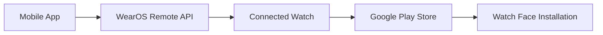

# React Native Patriot Native

[](https://badge.fury.io/js/%40haykmkrtich%2Freact-native-patriot-native)
[](https://opensource.org/licenses/MIT)
[](https://reactnative.dev/)

> 🚀 Seamlessly install WearOS watch faces and retrieve device information directly from your React Native mobile application.

## ✨ What's New in v1.0.5

- 🔍 **Device Detection**: New `getConnectedWatchProperties()` function
- 📱 **Multi-Platform Support**: Detect WearOS, Fitbit, and other wearable devices
- 🏷️ **Device Information**: Get name, platform, type, and unique ID
- 🛡️ **Enhanced Error Handling**: Improved disconnection detection

## 🚀 Quick Start

```bash
npm install @haykmkrtich/react-native-patriot-native
```

```typescript
import { installWatchface, getConnectedWatchProperties } from '@haykmkrtich/react-native-patriot-native';

// Install watchface
await installWatchface('com.example.watchface.package');

// Get device info
const watch = await getConnectedWatchProperties();
console.log(`Connected: ${watch.displayName} (${watch.platform})`);
```

## 📋 Requirements

- ⚛️ React Native ≥ 0.60.0
- 🤖 Android API level 21+ (Android 5.0+)
- ⌚ Paired WearOS device

## 🎯 Features

| Feature | Description |
|---------|-------------|
| 📦 **Watch Face Installation** | Install watch faces directly on paired WearOS devices |
| 🔍 **Device Detection** | Retrieve detailed information about connected devices |
| 🏷️ **Platform Detection** | Identify WearOS, Fitbit, and other wearable platforms |
| 📡 **Connection Status** | Monitor device connectivity and proximity |
| 🔄 **Promise-based API** | Modern async/await support |
| 💬 **Native Feedback** | Toast notifications for user feedback |

## 📖 API Reference

### `installWatchface(packageName: string)`

Initiates watch face installation on connected WearOS device.

```typescript
try {
  await installWatchface('com.example.watchface.package');
  // ✅ Installation initiated successfully
} catch (error) {
  // ❌ Handle installation errors
}
```

**Errors:**
- `NO_NODES` - No connected WearOS device
- `INSTALL_FAILED` - Installation process failed

### `getConnectedWatchProperties()`

Retrieves detailed information about connected wearable devices.

```typescript
interface WatchProperties {
  id: string;                    // Unique device identifier
  displayName: string;           // Human-readable device name  
  isNearby: boolean;            // Device proximity status
  type: string;                 // Device type (e.g., "watch")
  platform: string;            // Platform ("wearOS" | "fitbit")
  isDisconnected?: boolean;     // No device connected
}
```

**Example Response:**
```typescript
// ✅ Connected Device
{
  id: "node_12345_abcdef",
  displayName: "Galaxy Watch 4", 
  isNearby: true,
  type: "watch",
  platform: "wearOS"
}

// ❌ No Device
{ isDisconnected: true }
```

## 🔧 Setup Requirements

### Android Dependencies

Add to your `android/app/build.gradle`:

```gradle
dependencies {
    implementation 'com.google.android.gms:play-services-wearable:18.1.0'
    implementation 'androidx.wear:wear-remote-interactions:1.0.0'
}
```

### WearOS Development Best Practices

> ⚠️ **Important**: For Google Play Console compliance, create **two applications** with identical package names:
> - 📱 Mobile companion app (React Native)
> - ⌚ WearOS watch face app

This ensures proper functionality and distribution through Google Play Store.

## 🛠️ How It Works



1. **Device Discovery** - Scan for connected WearOS devices
2. **Remote Installation** - Send installation request to watch
3. **Play Store Integration** - Open watch face listing on device
4. **User Confirmation** - User confirms installation on watch

## 💡 Usage Examples

### Basic Installation
```typescript
import { installWatchface } from '@haykmkrtich/react-native-patriot-native';

const handleInstall = async (packageName: string) => {
  try {
    await installWatchface(packageName);
    console.log('✅ Check your watch for installation prompt');
  } catch (error) {
    console.error('❌ Installation failed:', error.message);
  }
};
```

### Device Information
```typescript
import { getConnectedWatchProperties } from '@haykmkrtich/react-native-patriot-native';

const checkWatchStatus = async () => {
  try {
    const watch = await getConnectedWatchProperties();
    
    if (watch.isDisconnected) {
      return '❌ No watch connected';
    }
    
    return `✅ ${watch.displayName} (${watch.platform}) - ${watch.isNearby ? 'Nearby' : 'Away'}`;
  } catch (error) {
    return `❌ Detection failed: ${error.message}`;
  }
};
```

## 🤝 Contributing

Contributions are welcome! Please read our [contributing guidelines](CONTRIBUTING.md) before submitting PRs.

1. Fork the repository
2. Create your feature branch (`git checkout -b feature/amazing-feature`)
3. Commit your changes (`git commit -m 'Add amazing feature'`)
4. Push to the branch (`git push origin feature/amazing-feature`)
5. Open a Pull Request

## 📄 License

This project is licensed under the MIT License - see the [LICENSE](LICENSE) file for details.

## 👨‍💻 Author

**Hayk Mkrtich**
- GitHub: [@HaykMkrtich](https://github.com/HaykMkrtich)
- NPM: [@haykmkrtich](https://www.npmjs.com/~haykmkrtich)

## 🆘 Support

- 🐛 **Bug Reports**: [Create an issue](https://github.com/HaykMkrtich/react-native-patriot-native/issues/new?template=bug_report.md)
- 💡 **Feature Requests**: [Request a feature](https://github.com/HaykMkrtich/react-native-patriot-native/issues/new?template=feature_request.md)
- 📖 **Documentation**: [View full docs](https://github.com/HaykMkrtich/react-native-patriot-native/wiki)

---

<div align="center">

**⭐ Star this repository if it helped you!**

Made with ❤️ for the React Native community

</div>